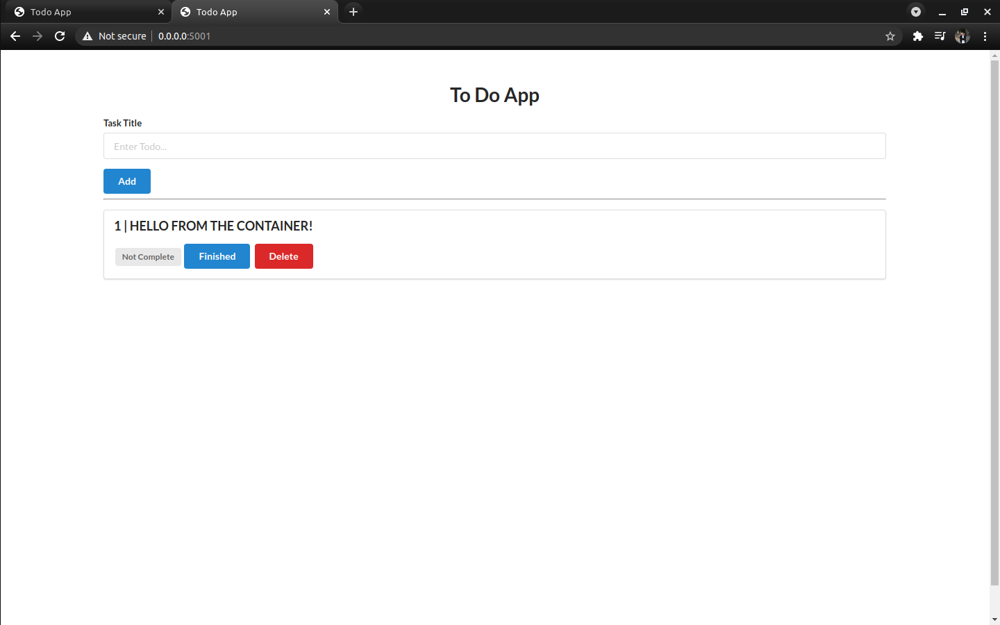
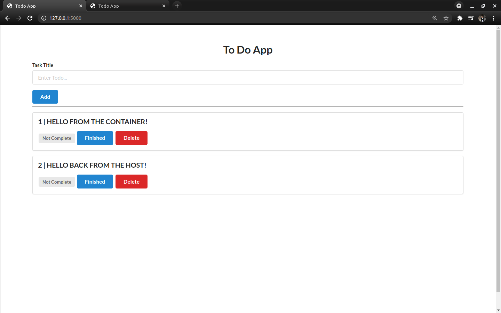
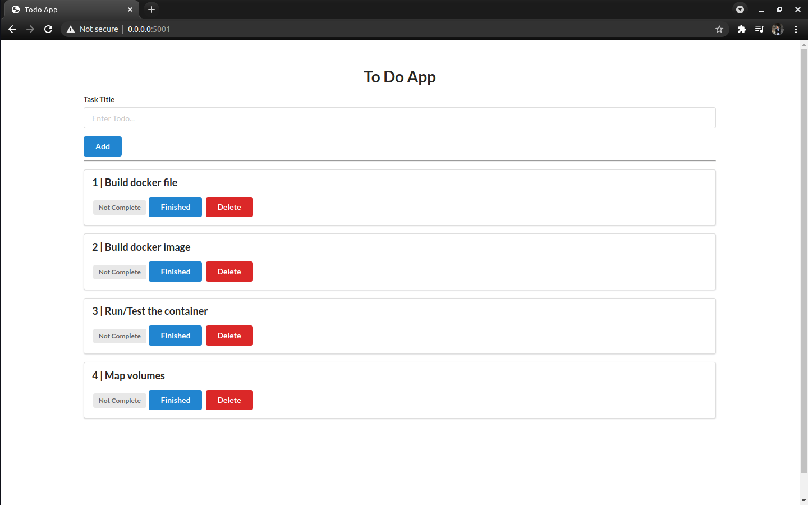
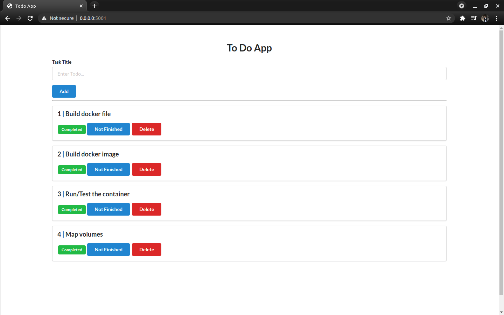
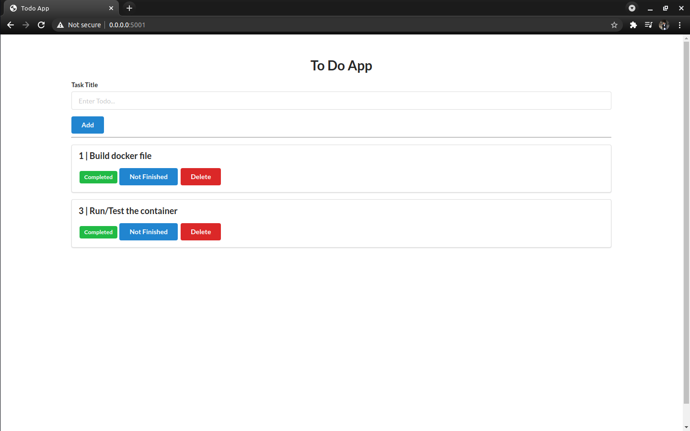

# TO DO LIST - FLASK - DOCKER - Heroku - GITHUB ACTIONS Hands-On

<b>Simple web-project to practice docker and deployment concepts </b>
- writing docker files
- building images
- running container and manage them
- persisting data 
- playing around with docker volumes and volume mapping
- deployment on heroku
- basic pipeline
- writing Git-Hub Actions Workflow file
- Git-Hub Actions to build and push the docker image to the registry on each push/PR


## Running 

### Try it out live on heroku!
[TO DO LIST](https://todolist-docker.herokuapp.com/)

### USING DOCKER - PULLING FROM DOCKER HUB

```bash
# pull the image from docker hub
$ docker pull a7medayman6/todolist-flask

# create docker volume for the database to keep your tasks everytime you run ir
$ docker volume create todolist.db

# run the container
# map port 5000 in the container to 5001 (or any other free port)
# map the docker volume you created to /app/db 
$ docker run -d -p 5001:5000 -v todolist.db:/app/db a7medayman6/todolist-flask

# open the browser, go to http://0.0.0.0:5001 and here is your todo list up and running
```

### USING DOCKER - BUILD DOCKER IMAGE

```bash
# clone the repo into your local host
$ git clone https://github.com/a7medayman6/Todo-List-Dockerized-Flask-WebApp

$ cd Todo-List-Dockerized-Flask-WebApp

# this will build the docker image from the docker file
docker build -t todolist-flask:latest .

# check the build was succesfull
$ docker images | grep todolist-flask
# the output should be
# todolist-flask

# create docker volume for the database to keep your tasks everytime you run it
$ docker volume create todolist.db

# run the container
# map port 5000 in the container to 5001 (or any other free port)
# map the docker volume you created to /app/db 
docker run -d -p 5001:5000 -v todolist.db:/app/db todolist-flask

# open the browser, go to http://0.0.0.0:5001 and here is your todo list up and running
```
### BUILDING

```bash
$ git clone https://github.com/a7medayman6/Todo-List-Dockerized-Flask-WebApp
$ cd Todo-List-Dockerized-Flask-WebApp
$ source env/bin/activate
$ python3 -r requirements.txt
$ python3 app.py
```
## Volume mapping 
- I was running the app from the docker container on port 5001 and from the local host at port 5000 
- Mapped the /home/ahmed/todo-flask/db/ directory in the local host to /app/db in the container to have the same data updating in both tabs and to persist the data using this command
```docker 
$ docker run -it -p 5001:5000 -v /home/ahmed/todo-flask/db/:/app/db/ todolist-flask
```
- created a task in the container tab
<br>



- switched to the local-host tab, and wallah the same task are here, let's say hi back from the local host!
<br>



## Features
- Add new tasks.
- Mark task as finished/unfinished.
- Delete a task.
<br>




